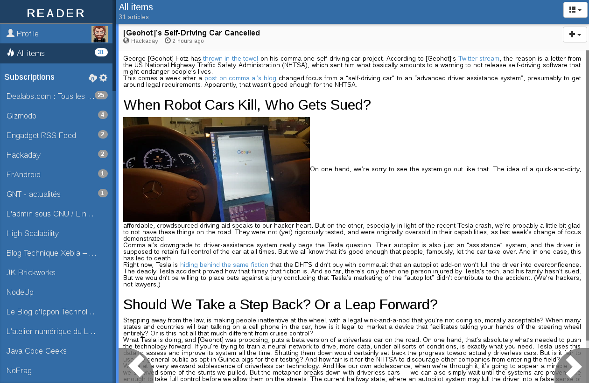

[](https://travis-ci.org/ncarlier/nunux-reader)
[](https://heroku.com/deploy?template=https://github.com/ncarlier/nunux-reader)

# NUNUX Reader

The super-fast-minimalist-nosql-opensource Google Reader revival.



Features:

 * Faster than light thanks to Redis and Node.js
 * Dynamic GUI thanks to AngularJS
 * Responsive Web Design
 * Login with Google OAuth2 or Mozilla Persona
 * OPML import/export
 * Manage subscriptions
 * Save articles in [Nunux Keeper](http://keeper.nunux.org), Pocket or Dropbox
 * Keep article as not read
 * Powerfull reactive aggregator daemon
 * Support of PubSubHubbud
 * RESTFul JSON [API](http://reader.nunux.org/doc/)
 * 100% Javascript!

## Installation guide with Docker (the recommended way)

### Prerequisites

* [docker](http://www.docker.com/)

### Start the Redis server

    docker run --name redis -d redis

### Start the Web Site

Configure the application according your needs by editing "./etc/default/dev.ev" file.
(see ./etc/default/dev.env in this repository for more details)

Then start the Web Server:

```
make start
```

OR

```
docker run \
    --rm \
    --name reader-server \
    --link redis:db \
    --env-file ./etc/default/dev.env \
    -p 3000:3000
    -i -t \
    ncarlier/reader
```

Go to http://localhost:3000 and the magic happens.

### Start the feed updater daemon

This daemon is responsible to fetch articles of  the registered subscriptions.

```
docker run \
    --rm \
    --name reader-feed-updater \
    --link redis:db \
    --env-file ./etc/default/dev.env \
    -i -t \
    ncarlier/reader run feed-updater
```

### Start the timeline updater daemon

This daemon is responsible to update user's timelines.

```
docker run \
    --rm \
    --name reader-timeline-updater \
    --link redis:db \
    --env-file ./etc/default/dev.env \
    -i -t \
    ncarlier/reader run timeline-updater
```

## Installation guide from scratch (the -not so- hard way)

### Prerequisites

* [git](http://git-scm.com/)
* [nodejs](http://nodejs.org/) v0.10.x
* [redis](http://redis.io/) v2.2

#### Install Git, Node.JS and Redis (on Debian)

```
sudo aptitude install git nodejs redis-server
```

#### Install Grunt

```
sudo npm install -g grunt-cli
```

### Install Web Site

```
cd /opt_
git clone git@github.com:ncarlier/nunux-reader.git
cd nunux-reader
npm install
```

### Run Web Site

```
#!/bin/sh
# See etc/default/dev.env for environment configuration.
source ./etc/default/dev.env
npm start 2>&1 >> app.log
```

### Jobs

* **clean-db.js**: Clean database (aka remove old articles). Usage:

```
./server/daemon/db-cleaner.js -v --days 30
```

* **feed-updater.js**: Update feeds content. It's a daemon. Use CTRL+C to stop. Usage:

```
./server/daemon/feed-updater.js -v
```

* **timeline-updater.js**: Update users timelines. It's a daemon. Use CTRL+C to stop. Usage:

```
./server/daemon/timeline-updater.js -v
```


------------------------------------------------------------------------------

NUNUX Reader

Copyright (c) 2013 Nicolas CARLIER (https://github.com/ncarlier)

This program is free software: you can redistribute it and/or modify
it under the terms of the GNU General Public License as published by
the Free Software Foundation, either version 3 of the License.

This program is distributed in the hope that it will be useful,
but WITHOUT ANY WARRANTY; without even the implied warranty of
MERCHANTABILITY or FITNESS FOR A PARTICULAR PURPOSE.  See the
GNU General Public License for more details.

You should have received a copy of the GNU General Public License
along with this program.  If not, see <http://www.gnu.org/licenses/>.

------------------------------------------------------------------------------
